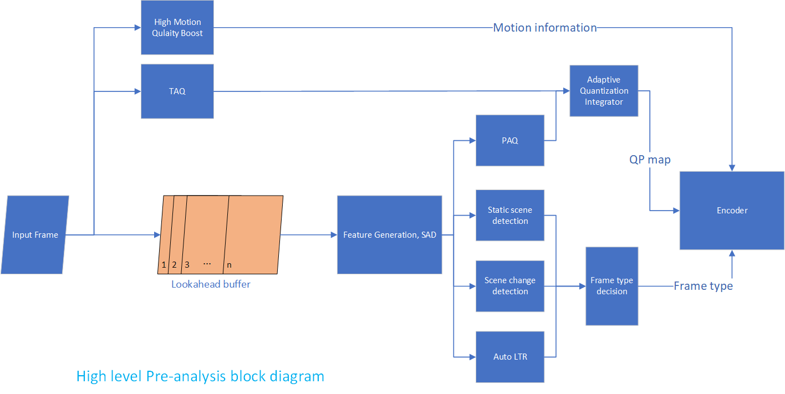

#### Advanced Micro Devices

# Advanced Media Framework – Pre-Analysis Component

#### Programming Guide

---

### Disclaimer

The information contained herein is for informational purposes only, and is subject to change without notice. While every precaution has been taken in the preparation of this document, it may contain technical inaccuracies, omissions and typographical errors, and AMD is under no obligation to update or otherwise correct this information.

Advanced Micro Devices, Inc. makes no representations or warranties with respect to the accuracy or completeness of the contents of this document, and assumes no liability of any kind, including the implied warranties of noninfringement, merchantability or fitness for particular purposes, with respect to the operation or use of AMD hardware, software or other products described herein. No license, including implied or arising by estoppel, to any intellectual property rights is granted by this document. Terms and limitations applicable to the purchase or use of AMD’s products are as set forth in a signed agreement between the parties or in AMD's Standard Terms and Conditions of Sale.

AMD, the AMD Arrow logo, ATI Radeon™, CrossFireX™, LiquidVR™, TrueAudio™ and combinations thereof are trademarks of Advanced Micro Devices, Inc. Other product names used in this publication are for identification purposes only and may be trademarks of their respective companies.

Windows™, Visual Studio and DirectX are trademark of Microsoft Corp.

---

### Copyright Notice

© 2013-2024 Advanced Micro Devices, Inc. All rights reserved

Notice Regarding Standards.  AMD does not provide a license or sublicense to any Intellectual Property Rights relating to any standards, including but not limited to any audio and/or video codec technologies such as MPEG-2, MPEG-4; AVC/H.264; HEVC/H.265; AAC decode/FFMPEG; AAC encode/FFMPEG; VC-1; and MP3 (collectively, the “Media Technologies”). For clarity, you will pay any royalties due for such third-party technologies, which may include the Media Technologies that are owed as a result of AMD providing the Software to you.

### MIT license 

Copyright (c) 2024 Advanced Micro Devices, Inc. All rights reserved.

Permission is hereby granted, free of charge, to any person obtaining a copy of this software and associated documentation files (the "Software"), to deal in the Software without restriction, including without limitation the rights to use, copy, modify, merge, publish, distribute, sublicense, and/or sell copies of the Software, and to permit persons to whom the Software is furnished to do so, subject to the following conditions:

The above copyright notice and this permission notice shall be included in all copies or substantial portions of the Software.

THE SOFTWARE IS PROVIDED "AS IS", WITHOUT WARRANTY OF ANY KIND, EXPRESS OR IMPLIED, INCLUDING BUT NOT LIMITED TO THE WARRANTIES OF MERCHANTABILITY, FITNESS FOR A PARTICULAR PURPOSE AND NONINFRINGEMENT.  IN NO EVENT SHALL THE AUTHORS OR COPYRIGHT HOLDERS BE LIABLE FOR ANY CLAIM, DAMAGES OR OTHER LIABILITY, WHETHER IN AN ACTION OF CONTRACT, TORT OR OTHERWISE, ARISING FROM, OUT OF OR IN CONNECTION WITH THE SOFTWARE OR THE USE OR OTHER DEALINGS IN THE SOFTWARE.

---

### Contents

- [Advanced Media Framework – Pre-Analysis Component](#advanced-media-framework--pre-analysis-component)
      - [Programming Guide](#programming-guide)
    - [Disclaimer](#disclaimer)
    - [Copyright Notice](#copyright-notice)
    - [MIT license](#mit-license)
    - [Contents](#contents)
  - [1 Introduction](#1-introduction)
    - [1.1 Scope](#11-scope)
    - [1.2 Overview](#12-overview)
    - [1.3 Supported Hardware](#13-supported-hardware)
    - [1.4 Disclaimer](#14-disclaimer)
  - [2 AMF PA - Encoder Mode](#2-amf-pa---encoder-mode)
    - [2.1 Input / Output Format](#21-input--output-format)
    - [2.2 Properties](#22-properties)
    - [2.3 Sample Application](#23-sample-application)
  - [3 AMF PA - Standalone Mode](#3-amf-pa---standalone-mode)
    - [3.1 Input / Output Format](#31-input--output-format)
    - [3.2 Properties](#32-properties)
    - [3.3 Sample Application](#33-sample-application)
  - [4 Annex A: Glossary of Acronyms](#4-annex-a-glossary-of-acronyms)

## 1 Introduction

### 1.1 Scope

This document describes the Pre-Analysis (PA) component of the AMD Advanced Media Framework (AMF). Full documentation on AMF can be found at https://gpuopen.com/gaming-product/advanced-media-framework/.

### 1.2 Overview

The AMF PA component accepts raw input images in NV12 format. It calculates a metric for content activity of different blocks across every image, as well as video property flags such as scene change and static scene flags. In the current release, spatial complexity is used as a measure of activity inside each block.

These results can be leveraged during an encode session targeting improved perceptual quality of the encoder’s reconstructed video signal, or it can be used to report information back to any other application for leverage in a way the SDK user may see fit. The AMF PA component does not alter the input images in any way; pixels within images will be inspected but no pixel value will be changed.

   

   Figure 1 high level PA block diagram

The AMF PA component aims at being codec-agnostic. Content adaptive encoding using PA may also help to expand the HW encoder’s capabilities. The analysis results will be used by AMD HW encoder(s) to potentially improve the overall encoding quality. Perceptual quality improvement impacts the distribution of bits among different video units, and hence it may sometimes lead to drops in quality when measured in objective metrics such as PSNR.

The AMF PA component can be used in one of two modes: encoder mode or standalone mode. In the encoder mode, the AMF PA component is instantiated as part of the AMF HW encoder pipeline. It analyzes the encoder input data before encoding. In the standalone mode, the AMF PA component is instantiated as a separate AMF component. It takes in raw video images and outputs a set of video statistics, which can be passed to third party encoder(s) or any other application(s).

### 1.3 Supported Hardware

The AMF PA feature is supported by Radeon RX 5000 Series or newer GPUs as well as Ryzen 2000 U/H series or newer APUs.

### 1.4 Disclaimer

The current AMF PA component is in its beta release. Existing features may get optimized over time, and new features may also be added in future releases.

---

## 2 AMF PA - Encoder Mode

The AMF PA component is instantiated within the AMF Encoder component as part of the encoder’s pipeline. The encoder’s input is first pre-analyzed by PA. During encoding, when either `AMF_PA_PAQ_MODE` or `AMF_PA_TAQ_MODE` is enabled, adaptive quantization is applied based on the results generated by PA. The encoder also makes various encoding decisions based on PA results. For example, depending on whether the PA scene change detection flag is triggered or not, the encoder may force an intra encoded frame and apply a new frame QP at the new scene. The encoder may also insert a skip frame based on whether the PA static scene detection flag is triggered or not.

`AMF_PA_PAQ_MODE` and `AMF_PA_TAQ_MODE` cannot work with VBAQ (`AMF_VIDEO_ENCODER_ENABLE_VBAQ`) features. When `AMF_PA_PAQ_MODE` or `AMF_PA_TAQ_MODE` is enabled, VBAQ settings are ignored. 

`AMF_PA_HIGH_MOTION_QUALITY_BOOST_MODE` and `AMF_PA_TAQ_MODE` both requires multiple frames lookahead. These two features take effect only when `AMF_PA_LOOKAHEAD_BUFFER_DEPTH` is enabled.

### 2.1 Input / Output Format

The input / output is handled by the AMF Encoder component. No special setting is needed for AMF PA.

### 2.2 Properties

Table 1 shows the available parameters in AMF PA encoder mode. The list underneath provides the detailed description of these parameters.

---

| Name (prefix "AMF_PA_")            | Type                                           |
| :--------------------------------- | :--------------------------------------------- |
| ENGINE_TYPE                        | AMF_MEMORY_TYPE                                |
| ACTIVITY_TYPE                      | AMF_PA_ACTIVITY_TYPE_ENUM                      |
| SCENE_CHANGE_DETECTION_ENABLE      | bool                                           |
| SCENE_CHANGE_DETECTION_SENSITIVITY | AMF_PA_SCENE_CHANGE_DETECTION_SENSITIVITY_ENUM |
| STATIC_SCENE_DETECTION_ENABLE      | bool                                           |
| STATIC_SCENE_DETECTION_SENSITIVITY | AMF_PA_STATIC_SCENE_DETECTION_SENSITIVITY_ENUM |
| INITIAL_QP_AFTER_SCENE_CHANGE      | amf_uint64                                     |
| MAX_QP_BEFORE_FORCE_SKIP           | amf_uint64                                     |
| CAQ_STRENGTH                       | AMF_PA_CAQ_STRENGTH_ENUM                       |
| FRAME_SAD_ENABLE                   | bool                                           |
| LTR_ENABLE                         | bool                                           |
| LOOKAHEAD_BUFFER_DEPTH             | amf_uint64                                     |
| PAQ_MODE                           | AMF_PA_PAQ_MODE_ENUM                           |
| TAQ_MODE                           | AMF_PA_TAQ_MODE_ENUM                           |
| HIGH_MOTION_QUALITY_BOOST_MODE     | AMF_PA_HIGH_MOTION_QUALITY_BOOST_MODE_ENUM     |

Table 1. AMF PA properties in encoder mode

---

**Name:**
`ENGINE_TYPE`

**Values:**
`AMF_MEMORY_HOST`, `AMF_MEMORY_DX11`, `AMF_MEMORY_OPENCL`, `AMF_MEMORY_VULKAN`, `AMF_MEMORY_DX12`

**Default Value:**
`AMF_MEMORY_OPENCL`

**Description:**
Determines what type of kernel PA uses.

---

**Name:**
`ACTIVITY_TYPE`

**Values:**
`AMF_PA_ACTIVITY_Y`, `AMF_PA_ACTIVITY_YUV`

**Default Value:**
`AMF_PA_ACTIVITY_Y`

**Description:**
Determines whether activity analysis is performed on the Luma component only (Y) or on both Luma and Chroma (YUV).

---

**Name:**
`SCENE_CHANGE_DETECTION_ENABLE`

**Values:**
`true`, `false`

**Default Value:**
`true`

**Description:**
Enables scene change detection.

---

**Name:**
`SCENE_CHANGE_DETECTION_SENSITIVITY`

**Values:**
`AMF_PA_SCENE_CHANGE_DETECTION_SENSITIVITY_LOW`, `AMF_PA_SCENE_CHANGE_DETECTION_SENSITIVITY_MEDIUM`, `AMF_PA_SCENE_CHANGE_DETECTION_SENSITIVITY_HIGH`

**Default Value:**
`AMF_PA_SCENE_CHANGE_DETECTION_SENSITIVITY_MEDIUM`

**Description:**
Sensitivity of scene change detection. The higher the sensitivity, the more restrictive it is to detect a scene change.This parameter takes effect only when AMF_PA_LOOKAHEAH_BUFFER_DEPTH is set to 0.

---

**Name:**
`STATIC_SCENE_DETECTION_ENABLE`

**Values:**
`true`, `false`

**Default Value:**
`false`

**Description:**
Enables static scene detection. A frame in a static scene will be encoded as a skip frame if the reference frame quality is acceptable. Refer to AMF_PA_MAX_QP_BEFORE_FORCE_SKIP for details.

---

**Name:**
`STATIC_SCENE_DETECTION_SENSITIVITY`

**Values:**
`AMF_PA_STATIC_SCENE_DETECTION_SENSITIVITY_LOW`, `AMF_PA_STATIC_SCENE_DETECTION_SENSITIVITY_MEDIUM`, `AMF_PA_STATIC_SCENE_DETECTION_SENSITIVITY_HIGH`

**Default Value:**
`AMF_PA_STATIC_SCENE_DETECTION_SENSITIVITY_HIGH`

**Description:**
Sensitivity of static scene detection. The higher the sensitivity, the more restrictive it is to detect a static scene.

---

**Name:**
`INITIAL_QP_AFTER_SCENE_CHANGE`

**Values:**
`0 - 51`

**Default Value:**
`0`

**Description:**
The QP value that is used immediately after a scene change. When this parameter value equals 0, PA will automatically calculate a QP value for the new scene.

---

**Name:**
`MAX_QP_BEFORE_FORCE_SKIP`

**Values:**
`0 - 51`

**Default Value:**
`35`

**Description:**
To maintain acceptable encoding quality, a static frame is allowed to be encoded as a skip frame only when the average QP value across the blocks of the previously-encoded frame is less than or equal to this value/threshold.

---

**Name:**
`CAQ_STRENGTH`

**Values:**
`AMF_PA_CAQ_STRENGTH_LOW`, `AMF_PA_CAQ_STRENGTH_MEDIUM`, `AMF_PA_CAQ_STRENGTH_HIGH`

**Default Value:**
`AMF_PA_CAQ_STRENGTH_MEDIUM`

**Description:**
Content Adaptive Quantization strength. Stronger CAQ strength means larger variation in block level QP assignment.

---

**Name:**
`FRAME_SAD_ENABLE`

**Values:**
`true`, `false`

**Default Value:**
`true`

**Description:**
Enables Frame SAD algorithm.

---

**Name:**
`LTR_ENABLE`

**Values:**
`true`, `false`

**Default Value:**
`false`

**Description:**
Enables automatic long term reference frame management. Last frame of a scene will be saved as LTR frame and used as reference when a similar frame occurs again.

---

**Name:**
`LOOKAHEAD_BUFFER_DEPTH`

**Values:**
`0 - MAX_LOOKAHEAD_DEPTH`

**Default Value associated with usages:**
   - Transcoding: `0`
   - Ultra low latency: `0`
   - Low latency: `0`
   - Webcam: `0`
   - HQ: `11`
   - HQLL: `0`

**Description:**
Sets the PA lookahead buffer size. The longer the buffer depth, the better the quality and the longer the latency. Suggested lookahead buffer sizes are 11(short), 21(medium) or 41(long).

---

**Name:**
`PAQ_MODE`

**Values:**
`AMF_PA_PAQ_MODE_NONE`, `AMF_PA_PAQ_MODE_CAQ`

**Default Value:**
`AMF_PA_PAQ_MODE_NONE`

**Description:**
Sets the perceptual adaptive quantization mode.

---

**Name:**
`TAQ_MODE`

**Values:**
`AMF_PA_TAQ_MODE_NONE`, `AMF_PA_TAQ_MODE_1`, `AMF_PA_TAQ_MODE_2`

**Default Value associated with usages:**
   - Transcoding: `AMF_PA_TAQ_MODE_NONE`
   - Ultra low latency: `AMF_PA_TAQ_MODE_NONE`
   - Low latency: `AMF_PA_TAQ_MODE_NONE`
   - Webcam: `AMF_PA_TAQ_MODE_NONE`
   - HQ: `AMF_PA_TAQ_MODE_2`
   - HQLL: `AMF_PA_TAQ_MODE_NONE`

**Description:**
Sets the temporal adaptive quantization mode. MODE_1 is suitable for non-gaming applications whereas MODE_2 is suitable for gaming applications. MODE_2 is supported on encoder memory type DX11.

---

**Name:**
`HIGH_MOTION_QUALITY_BOOST_MODE`

**Values:**
`AMF_PA_HIGH_MOTION_QUALITY_BOOST_MODE_NONE`, `AMF_PA_HIGH_MOTION_QUALITY_BOOST_MODE_AUTO`

**Default Value associated with usages:**
   - Transcoding: `AMF_PA_HIGH_MOTION_QUALITY_BOOST_MODE_NONE`
   - Ultra low latency: `AMF_PA_HIGH_MOTION_QUALITY_BOOST_MODE_NONE`
   - Low latency: `AMF_PA_HIGH_MOTION_QUALITY_BOOST_MODE_NONE`
   - Webcam: `AMF_PA_HIGH_MOTION_QUALITY_BOOST_MODE_NONE`
   - HQ: `AMF_PA_HIGH_MOTION_QUALITY_BOOST_MODE_AUTO`
   - HQLL: `AMF_PA_HIGH_MOTION_QUALITY_BOOST_MODE_NONE`

**Description:**
Sets the PA high motion quality boost mode to help the encoder in motion search.

---

### 2.3 Sample Application

The TranscodeHW sample application in the SDK package illustrates how to setup and run AMF PA component in its encoder mode. It calculates the activity maps of the transcoder input and guides the succeeding encoding process. To enable the PA process in the encoder pipeline, use the command line parameter `-EnablePreAnalysis true`. Below is an example cmd line enabling PA:

`TranscodeHW.exe -input input.mp4  -output output.mp4 -width 1920 -height 1080 -usage transcoding -qualitypreset quality -targetBitrate 5000000 -frames 1000 -engine dx11 -EnablePreAnalysis true`

## 3 AMF PA - Standalone Mode

The standalone AMF PA component analyzes incoming video frames and produces an activity map for each video frame. Users also have the options to turn on the scene change detection and static scene detection features, in which cases AMF PA will return the scene change detection and/or static scene detection flags for the input frame.

### 3.1 Input / Output Format

The standalone AMF PA component accepts `AMF_SURFACE_R32` surfaces as input and produces activity maps also stored in `AMF_SURFACE_R32` surfaces. The resulting activity maps consist of one activity value (32-bit unsigned) for each 16x16 pixel block. The resulting activity map and scene change/static scene flags will be attached to the video frame structure.

### 3.2 Properties

Table 2 shows the available parameters in AMF PA standalone mode. The list underneath provides the detailed description of these parameters.

| Name (prefix "AMF_PA_")            | Type                                           |
| :--------------------------------- | :--------------------------------------------- |
| ENGINE_TYPE                        | AMF_MEMORY_TYPE                                |
| ACTIVITY_TYPE                      | AMF_PA_ACTIVITY_TYPE_ENUM                      |
| SCENE_CHANGE_DETECTION_ENABLE      | bool                                           |
| SCENE_CHANGE_DETECTION_SENSITIVITY | AMF_PA_SCENE_CHANGE_DETECTION_SENSITIVITY_ENUM |
| STATIC_SCENE_DETECTION_ENABLE      | bool                                           |
| ACTIVITY_MAP                       | AMFSurface*                                    |
| SCENE_CHANGE_DETECT                | bool                                           |
| STATIC_SCENE_DETECT                | bool                                           |

Table 2. AMF PA properties in standalone mode

---

**Name:**
`ENGINE_TYPE`

**Values:**
`AMF_MEMORY_DX11`, `AMF_MEMORY_OPENCL`

**Default Value:**
`AMF_MEMORY_OPENCL`

**Description:**
Determines what type of kernel PA uses.

---

**Name:**
`ACTIVITY_TYPE`

**Values:**
`AMF_PA_ACTIVITY_Y`, `AMF_PA_ACTIVITY_YUV`

**Default Value:**
`AMF_PA_ACTIVITY_Y`

**Description:**
Determines whether activity analysis is performed on the Luma component only (Y) or on both Luma and Chroma (YUV).

---

**Name:**
`SCENE_CHANGE_DETECTION_ENABLE`

**Values:**
`true`, `false`

**Default Value:**
`true`

**Description:**
Enables scene change detection.

---

**Name:**
`SCENE_CHANGE_DETECTION_SENSITIVITY`

**Values:**
`AMF_PA_SCENE_CHANGE_DETECTION_SENSITIVITY_LOW`, `AMF_PA_SCENE_CHANGE_DETECTION_SENSITIVITY_MEDIUM`, `AMF_PA_SCENE_CHANGE_DETECTION_SENSITIVITY_HIGH`

**Default Value:**
`AMF_PA_SCENE_CHANGE_DETECTION_SENSITIVITY_HIGH`

**Description:**
Sensitivity of scene change detection. The higher the sensitivity, the more restrictive it is to detect a scene change.

---

**Name:**
`STATIC_SCENE_DETECTION_ENABLE`

**Values:**
`true`, `false`

**Default Value:**
`false`

**Description:**
Enables static scene detection. A frame in a static scene will be encoded as a skip frame if the reference frame quality is acceptable. Refer to AMF_PA_MAX_QP_BEFORE_FORCE_SKIP for details.

---

**Name:**
`STATIC_SCENE_DETECTION_SENSITIVITY`

**Values:**
`AMF_PA_STATIC_SCENE_DETECTION_SENSITIVITY_LOW`, `AMF_PA_STATIC_SCENE_DETECTION_SENSITIVITY_MEDIUM`, `AMF_PA_STATIC_SCENE_DETECTION_SENSITIVITY_HIGH`

**Default Value:**
`AMF_PA_STATIC_SCENE_DETECTION_SENSITIVITY_MEDIUM`

**Description:**
Sensitivity of static scene detection. The higher the sensitivity, the more restrictive it is to detect a static scene.

---

**Name:**
`ACTIVITY_MAP`

**Values:**
`int32`

**Default Value:**
`N/A`

**Description:**
Activity map calculated for the input image where each value corresponds to one block. Properties set by PA on output buffer interface.

---

**Name:**
`SCENE_CHANGE_DETECT`

**Values:**
`true`, `false`

**Default Value:**
`N/A`

**Description:**
Scene change detection result.  When this flag is true, it means the PA has identified the frame as a scene change. Properties set by PA on output buffer interface.

---

**Name:**
`STATIC_SCENE_DETECTION_SENSITIVITY`

**Values:**
`true`, `false`

**Default Value:**
`N/A`

**Description:**
Static scene detection result. When this flag is true, it means the PA has identified the frame as a static scene. Properties set by PA on output buffer interface.

---

### 3.3 Sample Application

The SimplePA sample application in the AMF SDK package illustrates how to setup and run AMF PA component in standalone mode. It calculates the activity maps of machine-generated video surfaces and dumps it into a binary file.

## 4 Annex A: Glossary of Acronyms

| Acronym | Definition                       |
| ------- | :--------------------------------|
| AMF     | Advanced Media Framework         |
| PA      | Pre-Analysis                     |
| CAQ     | Content Adaptive Quantization    |
| PAQ     |	Perceptual Adaptive Quantization |
| TAQ     |	Temporal Adaptive Quantization   |
| SAD	    | Sum of absolute difference       |
| LTR	    | Long Term Reference              |